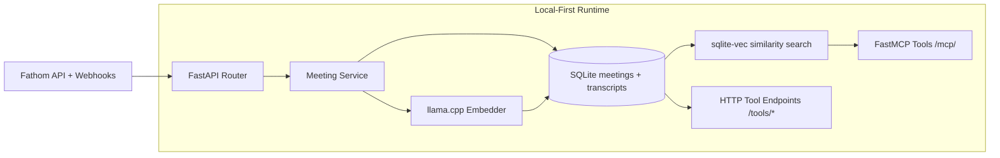

# Fathom MCP

**A local-first MCP server that turns Fathom meetings into an AI-searchable knowledge base.**

Fathom MCP ingests meetings and transcripts from Fathom, generates embeddings locally with `llama.cpp`, stores everything in SQLite + `sqlite-vec`, and exposes search/retrieval tools through FastMCP.

It is built for teams that want fast, private-by-default, low-infrastructure meeting intelligence that stays on their machine and works with MCP-native clients.

---

## Why This Project

Meeting recordings are high-value, but hard to query quickly.

This server gives you:

- Webhook and sync ingestion from Fathom.
- Semantic transcript search across all meetings.
- In-meeting transcript drilling for focused QA.
- A local vector stack (SQLite + GGUF embeddings) instead of external vector infrastructure.
- MCP tools that can be consumed by AI assistants and agent workflows.

---

## Local-First, By Design

Fathom MCP is intentionally designed so your searchable meeting knowledge lives locally:

- Transcript chunks and metadata are stored in local SQLite.
- Embeddings are generated in-process with a local GGUF model via `llama.cpp`.
- Similarity search runs with `sqlite-vec` in the same local database.
- No external vector DB, no hosted retrieval service, no extra data pipeline.

The only network dependency is Fathom ingestion (API/webhooks) and the one-time model download if the GGUF file is not already present.

---

## Core Capabilities

- **Hybrid server:** FastAPI API endpoints + FastMCP endpoint in one ASGI app.
- **Authenticated MCP:** Bearer token auth backed by constant-time comparison.
- **Webhook validation:** Svix-style signature verification with replay protection.
- **Background processing:** Webhook and sync jobs return quickly and process async.
- **Vector search:** `sqlite-vec` cosine distance search over locally stored transcript embeddings.
- **Local embedding model:** Automatic GGUF download once, then local reuse at startup.
- **Minimal moving parts:** No external cache, broker, or vector service required.

---

## Architecture



---

## Quick Start

### 1) Prerequisites

- Python 3.14+
- `uv`
- A Fathom API key and webhook secret

Install `uv` if needed:

```bash
curl -LsSf https://astral.sh/uv/install.sh | sh
```

### 2) Install dependencies

```bash
uv sync
```

### 3) Configure environment

Create a `.env` file in the project root:

```env
# Required
FATHOM_API_URL=https://api.fathom.ai/external/v1
FATHOM_API_KEY=your_fathom_api_key
FATHOM_WEBHOOK_SECRET=whsec_base64_encoded_secret
SERVICE_API_KEY=generate_a_unique_random_secret_for_this_server

# Optional (defaults shown)
HOST=0.0.0.0
PORT=8000
VECTOR_DB_PATH=./data/vectors.db
EMBEDDING_DIMENSION=384
EMBEDDING_MODEL_PATH=./data/bge-small-en-v1.5-q8_0.gguf
EMBEDDING_MODEL_URL=https://huggingface.co/ggml-org/bge-small-en-v1.5-Q8_0-GGUF/resolve/main/bge-small-en-v1.5-q8_0.gguf
```

Notes:

- Environment names are case-insensitive in this project configuration.
- `SERVICE_API_KEY` must be a real secret, not a placeholder such as `your_service_api_key`.
- On first startup, the embedding model is downloaded automatically if missing.
- If `EMBEDDING_MODEL_PATH` already exists, startup stays fully local for embedding operations.

### 4) Run the server

```bash
uv run main.py
```

For development reload:

```bash
uv run --reload main.py
```

Server defaults to `http://localhost:8000`.

### 5) Configure the Fathom webhook (recommended)

To receive near real-time meeting updates, configure Fathom to send `newMeeting`
events to this server.

Webhook endpoint:

```text
POST /webhook
```

Requirements:

- Your endpoint must be publicly accessible from the internet.
- Your endpoint must be served over HTTPS (valid TLS certificate).
- The webhook secret configured in Fathom must match `FATHOM_WEBHOOK_SECRET`.

Typical production URL example:

```text
https://your-domain.com/webhook
```

If running locally, expose your service through an HTTPS tunnel/reverse proxy
(for example: Cloudflare Tunnel, ngrok, or a public ingress) and use that
public HTTPS URL in Fathom.

---

## API and MCP Endpoints

### Public routes

- `POST /webhook` - receive Fathom `newMeeting` webhook payloads.
- `POST /sync` - trigger background pull of recent meetings.
- `GET /tools/*` - HTTP mirror of MCP tools for quick testing.
- `POST|GET /mcp/` - FastMCP streamable HTTP endpoint.

### Auth model

- `/sync`, `/tools/*`, and `/mcp/` require:
  - `Authorization: Bearer <SERVICE_API_KEY>`
  - `X-API-Key: <SERVICE_API_KEY>` for FastAPI routes (`/sync`, `/tools/*`)
  - OR localhost origin for selected FastAPI routes (`/sync`, `/tools/*`).
- `/webhook` requires valid Svix-style signature headers:
  - `webhook-id`
  - `webhook-timestamp`
  - `webhook-signature`

### Example calls

Trigger sync:

```bash
curl -X POST http://localhost:8000/sync \
  -H "Authorization: Bearer ${SERVICE_API_KEY}"

# Equivalent FastAPI auth header:
curl -X POST http://localhost:8000/sync \
  -H "X-API-Key: ${SERVICE_API_KEY}"
```

Search meetings:

```bash
curl "http://localhost:8000/tools/search_meetings?title=roadmap&limit=5" \
  -H "Authorization: Bearer ${SERVICE_API_KEY}"
```

Search transcripts semantically:

```bash
curl "http://localhost:8000/tools/search_transcripts?query=What%20did%20we%20decide%20about%20pricing%3F&limit=5" \
  -H "Authorization: Bearer ${SERVICE_API_KEY}"
```

Search within one meeting:

```bash
curl "http://localhost:8000/tools/search_meeting_transcripts?meeting_id=123&query=action%20items&limit=5" \
  -H "Authorization: Bearer ${SERVICE_API_KEY}"
```

Get meeting by ID:

```bash
curl "http://localhost:8000/tools/get_meeting?meeting_id=123" \
  -H "Authorization: Bearer ${SERVICE_API_KEY}"
```

Get full transcript chunks for a meeting:

```bash
curl "http://localhost:8000/tools/get_meeting_transcript?meeting_id=123" \
  -H "Authorization: Bearer ${SERVICE_API_KEY}"
```

---

## MCP Tools Exposed

The FastMCP server exposes these tool functions at `/mcp` for AI assistants and agent workflows:

- `search_meetings(title, start_date, end_date, limit)`
- `search_transcripts(query, limit)`
- `search_meeting_transcripts(meeting_id, query, limit)`
- `get_meeting(meeting_id)`
- `get_meeting_transcript(meeting_id)`

These map to the same data access layer used by the HTTP `/tools/*` routes.

---

## Local Data Model

SQLite database tables:

- `meetings`: canonical meeting metadata and summary/action-items payloads.
- `transcripts`: transcript chunks with associated embedding blob.
- `vec_transcripts` (virtual): vector index for KNN/cosine search via `sqlite-vec`.

Default DB path: `./data/vectors.db`.

This file-centric layout makes backup, migration, and inspection straightforward.

---

## Docker

Published image:

```bash
ghcr.io/chand1012/fathom-mcp:latest
```

Pull the latest image from GHCR:

```bash
docker pull ghcr.io/chand1012/fathom-mcp:latest
```

Run container:

```bash
mkdir -p ./data

docker run --rm -p 8000:8000 \
  -v "$(pwd)/data:/data" \
  -e FATHOM_API_URL="https://api.fathom.video" \
  -e FATHOM_API_KEY="your_fathom_api_key" \
  -e FATHOM_WEBHOOK_SECRET="whsec_base64_encoded_secret" \
  -e SERVICE_API_KEY="generate_a_unique_random_secret_for_this_server" \
  ghcr.io/chand1012/fathom-mcp:latest
```

If you prefer files on the host to be owned by your current user, add:

```bash
-u "$(id -u):$(id -g)"
```

The `./data` directory on your host is mounted to `/data` in the container,
so both `/data/bge-small-en-v1.5-q8_0.gguf` and `/data/vectors.db` persist
between container restarts.

Optional: if you want to build locally instead of using GHCR:

```bash
docker build -t fathom-mcp .
```

---

## Development Workflow

Run tests:

```bash
uv run pytest
```

Run specific test:

```bash
uv run pytest test_full_workflow.py::test_full_workflow
```

Lint and format:

```bash
uv run ruff check .
uv run ruff format .
```

Type checking:

```bash
uv run mypy .
```

---

## Project Layout

```text
src/fathom_mcp/
  api/
    client.py      # Fathom API client
    router.py      # Webhook/sync/tool HTTP endpoints
    service.py     # Fetch + store + transcript vectorization workflow
  core/
    config.py      # Pydantic settings and environment configuration
  mcp/
    server.py      # FastMCP server and tool registrations
  vector/
    database.py    # SQLite + sqlite-vec storage/search layer
    embedder.py    # Local llama.cpp embedding model integration
  webhooks/
    handler.py     # Svix signature verification + webhook ingestion
main.py            # Application assembly and startup lifecycle
```

---

## Security Notes

- Do not commit `.env` or secrets.
- Rotate `SERVICE_API_KEY` and webhook secret periodically.
- Keep `/mcp/` behind network controls in production.
- Validate webhook signatures before processing payloads (already enforced).
- Local-first reduces external data exposure by default because storage and vector search are on-box.

---

## Roadmap Ideas

- Incremental sync scheduling.
- Multi-tenant key management.
- Optional cloud embedding providers.
- Richer MCP tool metadata and pagination support.
- Observability dashboards for ingest/search latency.

---

## Contributing

PRs are welcome. Keep changes focused, include tests for behavior changes, and run lint/type checks before opening a PR.

---

## License

No license file is currently included in this repository.
